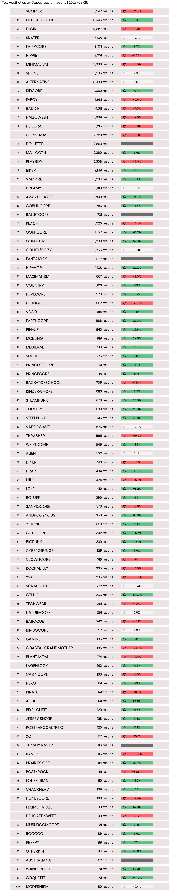

aesthetics-tracker
================
25 March, 2023

## Aesthetic Trends

This project monitors the [Aesthetics
Wiki](https://aesthetics.fandom.com/wiki/Aesthetics_Wiki) on Fandom.com
for new aesthetics, and then checks Depop for the number of search
results for the exact phrase + “aesthetic”.

[Visit the Trending Aesthetics
webpage](https://filmicaesthetic.github.io/aesthetics-tracker)

## Project process

The Aesthetics Tracker is updated daily around 1:30 GMT, scheduled with
Github Actions.

### Daily Web Scraping

#### Scrape Aesthetics Wiki

List of aesthetics, page URLs and other info are are scraped from
Aesthetics Wiki.

#### Scrape Depop

The number of search results is then scraped from Depop for each
aesthetic.

### Database

New records are added to a duckdb database for easy querying access to
allow for further analysis.

### Webpage

Current data is passed to an HTML file to update the [Trending
Aesthetics
webpage](https://filmicaesthetic.github.io/aesthetics-tracker)

<!-- -->

## Web scraping automation

Made with help from amrrs/scrape-automation:

